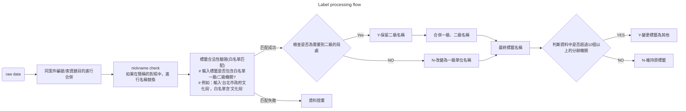

# Classification-of-information-requests-from-Members

安裝套件：
pandas: 2.2.3
numpy: 2.1.3
torch: 2.7.0+cu128
transformers: 4.51.3
sklearn((scikit-learn)): 1.6.1
tqdm: 4.67.1
openpyxl: 3.1.5
tokenizers: 0.21.1
tensorflow: 2.19.0
keras: 3.9.2
regex: 2024.11.6
accelerate: 1.7.0
wandb: 0.19.11
matplotlib: 3.10.3
tensorboard: 2.19.0
jieba: 0.42.1
csv: 內建
os: 內建

